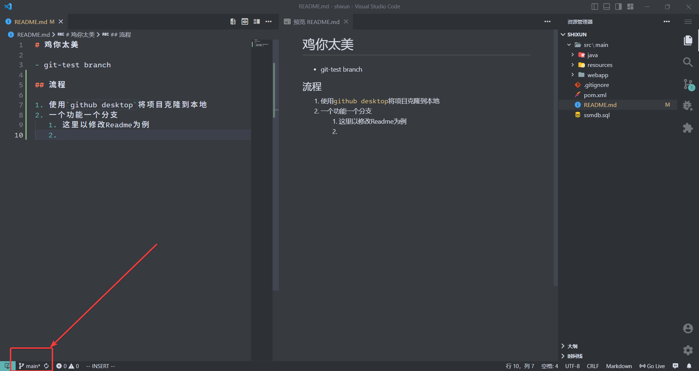
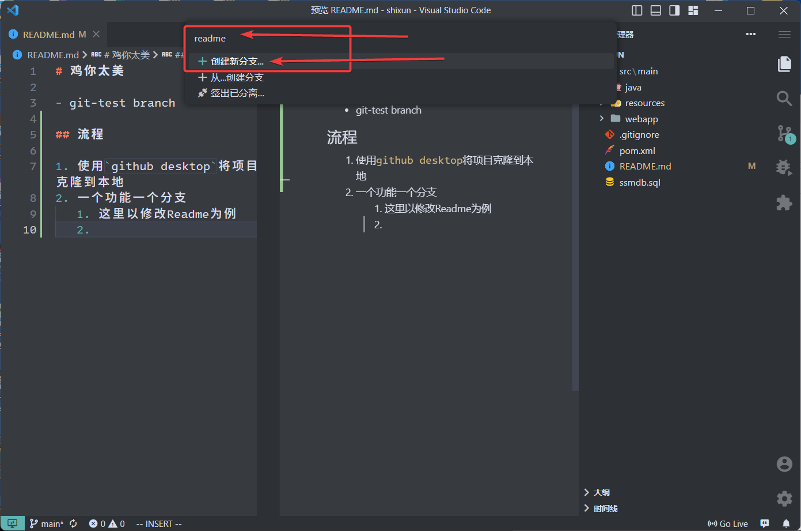
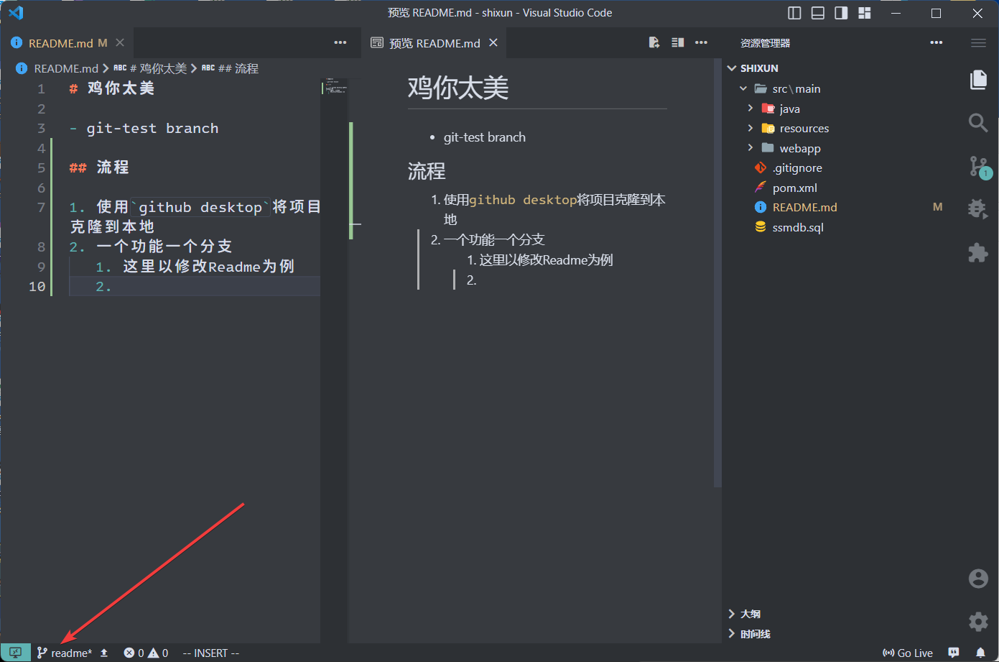

# 鸡你太美

- git-test branch 

## 流程

1. 使用`github desktop`将项目克隆到本地
2. 一个功能一个分支
   1. 这里以修改Readme为例
   2. 从main branch创建新分支
      1. 
      2. 
      3. 
   3. 之后修改的内容都在这个 readme 分支里， main 分支不会改变 
3. 完成这个功能后 push 到 github
    - 